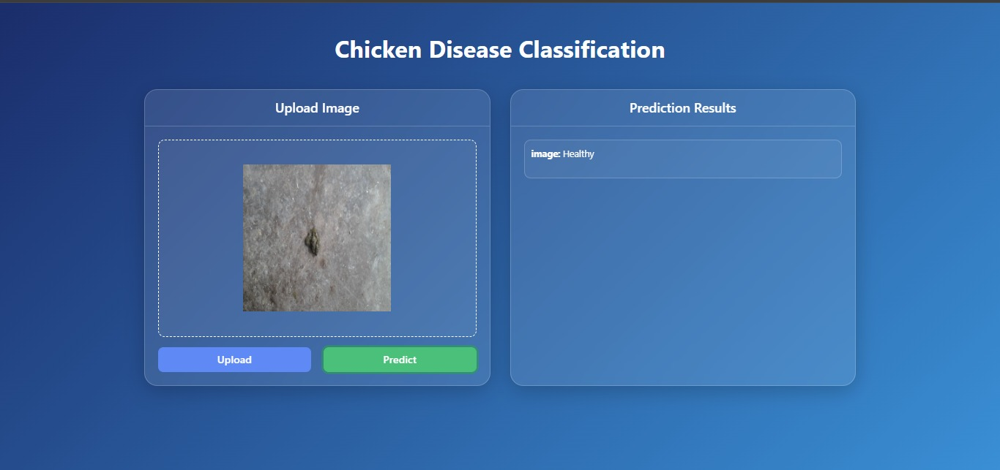

# 🐔 Chicken Disease Classification Using Deep Learning

Welcome to the Chicken Disease Classification project!  
This deep learning-based system detects whether a chicken is **Healthy** or infected with **Coccidiosis** using images of its feces. It combines powerful computer vision techniques with a simple web interface for real-time predictions.

---

## 🚀 Project Highlights

- 🧠 **Transfer Learning** with VGG16 (pre-trained on ImageNet)
- 📸 Detects **Coccidiosis** from **chicken fecal images**
- 🔁 Real-time predictions via a **Flask web application**
- 🔍 Achieved **92.24% accuracy**
- 📁 Easy to understand, well-structured repository

---

## 🧪 Tech Stack

- **Python 3**
- **TensorFlow / Keras**
- **VGG16** (with `include_top=False`)
- **Flask** (for the web app)
- **OpenCV, NumPy, Matplotlib**
- **Image Augmentation**

---

## Workflows
1.Update config.yaml
2.Update secrets.yaml [Optional]
3.Update params.yaml
4.Update the entity
5.Update the configuration manager in src config
6.Update the components
7.Update the pipeline
8.Update the main.py
9.Update the dvc.yaml

## 📊 Model Configuration

| Parameter        | Value         |
|------------------|---------------|
| Image Size       | 224 x 224 x 3 |
| Classes          | 2 (`Healthy`, `Coccidiosis`) |
| Batch Size       | 16            |
| Epochs           | 20            |
| Learning Rate    | 0.01          |
| Optimizer        | SGD           |
| Loss Function    | Categorical Crossentropy |
| Activation       | Softmax       |

---

## 🖼️ Sample Dataset

> Fecal images categorized into two classes:
- `Healthy`
- `Coccidiosis`

## 📈 Results

Training Accuracy: ~92.24%

Training Loss: ~0.95

Performs well on unseen fecal images with strong generalization.

---

## 🌐 Web App (Flask)

A simple web app is included to allow real-time predictions.

## 🤝 Contribution

Contributions are welcome!
Feel free to fork the repo, improve the model, add more disease classes, or enhance the UI.
📄 License
This project is licensed under the MIT License.

## 🙋‍♂️ About Me

I’m Swapnil Halder, a deep learning enthusiast and web developer.
Feel free to connect with me:

💼 LinkedIn: https://www.linkedin.com/in/swapnilhalder/

📫 Email: swapnilhalder701@gmail.com

